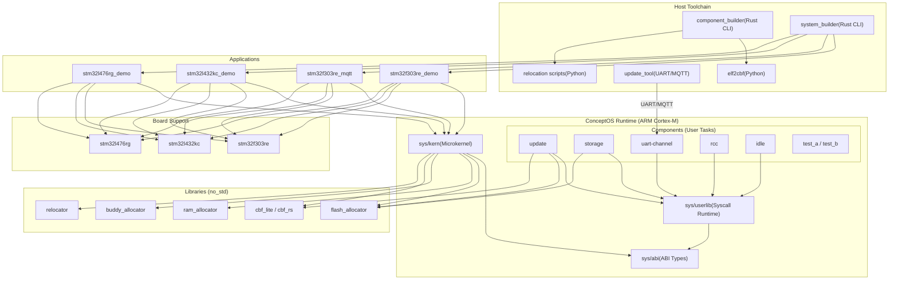

# ConceptOS — Multi-Branch Documentation Index

> Generated on: 2026-04-03  
> Repository: `concept-os`  
> Source data: `everything.md`, `everything2.md`

## Overview

ConceptOS is a **micro-kernel-based operating system** for ARM Cortex-M embedded devices, based on [Hubris](https://hubris.oxide.computer/) and written entirely in Rust. It was developed as a Master's Thesis project by Andrea Aspesi at Politecnico di Milano. The system supports **OTA (Over-The-Air) component updates** at the individual component level — a novel capability for microcontroller-class devices.

---

## Branch Summary Table

| # | Branch | Head Commit | Ahead/Behind main | Changed Files vs main | Doc File |
|---|--------|-------------|--------------------|-----------------------|----------|
| 1 | `main` | `bf03449` | 0 / 0 | 0 | [branch_main.md](branch_main.md) |
| 2 | `dev` | `bf03449` | 0 / 0 | 0 | [branch_dev.md](branch_dev.md) |
| 3 | `bthermo` | `d23cd1c` | 21 / 1 | 253 | [branch_bthermo.md](branch_bthermo.md) |
| 4 | `bthermo-resources` | `5738850` | 34 / 1 | 273 | [branch_bthermo_resources.md](branch_bthermo_resources.md) |
| 5 | `bthermo-performance` | `8152b12` | 42 / 1 | 332 | [branch_bthermo_performance.md](branch_bthermo_performance.md) |
| 6 | `l4-support` | `3ffae93` | 0 / 25 | 0 | [branch_l4_support.md](branch_l4_support.md) |
| 7 | `new-kernel-structures` | `8bb933a` | 0 / 27 | 0 | [branch_new_kernel_structures.md](branch_new_kernel_structures.md) |
| 8 | `new-kernel-structures-performace` | `ecbf917` | 2 / 28 | 23 | [branch_new_kernel_structures_perf.md](branch_new_kernel_structures_perf.md) |
| 9 | `new-relocation-method` | `13ac231` | 0 / 26 | 0 | [branch_new_relocation_method.md](branch_new_relocation_method.md) |

---

## Branch Relationship Diagram


```mermaid
gitgraph
    commit id: "Initial commit"
    branch dev
    checkout dev
    commit id: "Core OS development"
    branch l4-support
    checkout l4-support
    commit id: "STM32L476RG support"
    checkout dev
    branch new-kernel-structures
    checkout new-kernel-structures
    commit id: "Kernel data structures"
    branch new-kernel-structures-performace
    checkout new-kernel-structures-performace
    commit id: "Profiling + optimizations"
    checkout dev
    branch new-relocation-method
    checkout new-relocation-method
    commit id: "New relocation model"
    checkout dev
    merge l4-support
    merge new-kernel-structures
    merge new-relocation-method
    commit id: "Merged features"
    branch bthermo
    checkout bthermo
    commit id: "BThermo thermostat app"
    branch bthermo-resources
    checkout bthermo-resources
    commit id: "Resource analysis"
    checkout bthermo
    branch bthermo-performance
    checkout bthermo-performance
    commit id: "Performance analysis"
    checkout dev
    commit id: "Final refinements"
    checkout main
    merge dev
    commit id: "HBF→CBF rename"
```

---

## System Architecture Overview


