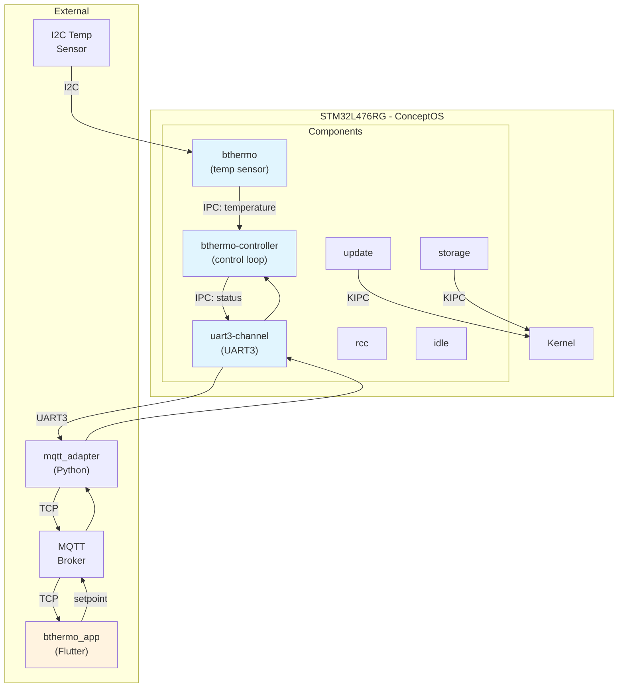
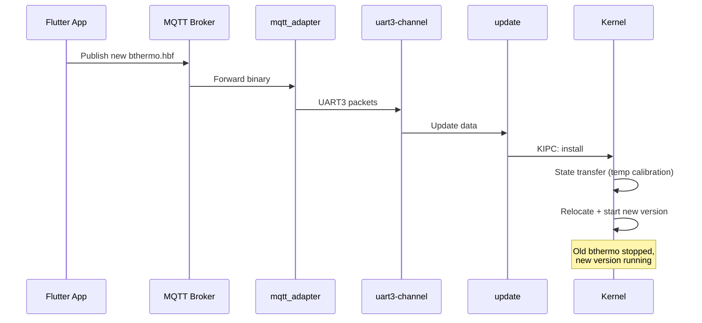

# ConceptOS — Branch: `bthermo`

> **Head Commit:** `d23cd1c4` — "Updated docs and readmes"  
> **Date:** 2023-03-21  
> **Tracked Files:** 4,829  
> **Total Commits:** 233  
> **Contributor:** Andrea Aspesi (aspex2014@gmail.com)

---

## 1. Branch Information

| Property | Value |
|----------|-------|
| Branch | `bthermo` |
| Head SHA | `d23cd1c49238ba1457e0c7b76ac3edb04e9c19f3` |
| First-parent commits | 214 |
| Reachable commits | 233 |
| Ahead of main | **21** |
| Behind main | **1** (missing CBF rename) |
| Changed files vs main | **253** |
| Role | **BThermo demonstration application** |

This branch implements the **BThermo** smart thermostat demonstration — a real-world IoT application showcasing ConceptOS's OTA update capabilities. It includes a Flutter-based mobile app, dedicated thermostat components, and a UART3 communication channel.

---

## 2. Repository Tree (Differences from `main`)

```text
concept-os/
├── app/
│   └── bthermo/                    # [NEW] BThermo application (replaces demo apps)
│       ├── App.toml                # Component composition for thermostat
│       ├── Cargo.toml
│       ├── Makefile
│       ├── FlashReport.html
│       ├── RAMReport.html
│       └── src/
├── components/
│   ├── bthermo/                    # [NEW] Temperature sensor component (api + core)
│   │   ├── api/                    # IPC client wrapper
│   │   └── core/                   # Sensor reading logic
│   ├── bthermo-controller/         # [NEW] Thermostat controller (core only)
│   │   └── core/                   # Control loop implementation
│   ├── uart3-channel/              # [NEW] UART3 serial channel (replaces uart-channel)
│   │   ├── api/
│   │   └── core/
│   ├── idle/
│   ├── rcc/
│   ├── storage/
│   └── update/
├── libs/
│   ├── hbf_lite/                   # [RETAINED] Still uses HBF naming (not renamed to CBF)
│   ├── hbf_rs/                     # [RETAINED] Still uses HBF naming
│   └── ...                         # (other libs same as main)
├── toolchain/
│   └── modules/
│       └── elf2hbf/                # [RETAINED] Still uses HBF naming (not elf2cbf)
├── utils/
│   ├── bthermo_app/                # [NEW] Flutter mobile app for thermostat control
│   │   ├── lib/                    # Dart source code
│   │   ├── android/                # Android platform files
│   │   ├── linux/                  # Linux platform files
│   │   ├── pubspec.yaml            # Flutter dependencies
│   │   ├── images/                 # App screenshots
│   │   └── README.md
│   └── mqtt_adapter/               # MQTT bridge utility
└── ...                             # (remaining dirs same as main)
```

### Key Differences from Main

| Area | Main | BThermo |
|------|------|---------|
| Apps | 4 demo apps (f303re, l432kc, l476rg) | 1 bthermo app |
| Components | test_a, test_b, uart-channel | bthermo, bthermo-controller, uart3-channel |
| Binary format naming | CBF (cbf_lite, cbf_rs, elf2cbf) | HBF (hbf_lite, hbf_rs, elf2hbf) |
| Utils | mqtt_adapter only | mqtt_adapter + bthermo_app (Flutter) |
| Dockerfile | Present | Removed |
| File extensions | `.cbf` | `.hbf` |

### File Distribution

| Extension | Count |
|-----------|------:|
| `.rs` | 4,292 |
| `.toml` | 196 |
| `.dart` | 30 |
| `.hbf` | 8 |

---

## 3. Detailed Code Explanation — Branch-Specific Components

### 3.1 `components/bthermo/` — Temperature Sensor Component

**Purpose:** Reads temperature data from an I2C sensor connected to the STM32L476RG and exposes it via IPC.

- **`api/`** — IPC client crate (`bthermo-api`) providing `get_temperature()` function for other components
- **`core/`** — Main task that:
  - Initializes I2C peripheral
  - Periodically reads temperature from sensor
  - Responds to IPC requests with current temperature
  - Supports state transfer during OTA updates (preserves calibration data)

### 3.2 `components/bthermo-controller/` — Thermostat Controller

**Purpose:** Implements the thermostat control loop logic.

- **`core/`** — Runs the control algorithm:
  - Reads temperature via IPC from `bthermo` component
  - Compares against setpoint received from mobile app
  - Controls heating/cooling GPIO outputs
  - Sends status updates via UART3 to the MQTT bridge

### 3.3 `components/uart3-channel/` — UART3 Communication Channel

**Purpose:** Replaces the generic `uart-channel` with a UART3-specific implementation for the BThermo board configuration. Uses UART3 pins (PB10/PB11 on STM32L476RG) to free UART2 for debugging.

### 3.4 `utils/bthermo_app/` — Flutter Mobile Application

**Purpose:** Cross-platform mobile app for monitoring and controlling the BThermo thermostat.

- **Technology:** Flutter/Dart
- **Platforms:** Android, Linux
- **Features:**
  - Real-time temperature graph display
  - Setpoint adjustment
  - MQTT communication with device
  - OTA update trigger from mobile

### 3.5 Naming: HBF vs CBF

This branch retains the original **HBF** (Hubris Binary Format) naming convention. The `main` branch renamed HBF → CBF (ConceptOS Binary Format) in its final commit, but `bthermo` diverged before that rename was fully applied. Libraries use `hbf_lite`/`hbf_rs` instead of `cbf_lite`/`cbf_rs`.

---

## 4. Dependencies

- **156 Cargo manifests** (same count as main)
- **239 unique Rust dependency keys** (+1 vs main: `bthermo-api`)
- Additional Flutter/Dart dependencies in `pubspec.yaml`
- Same Python dependencies as main

### Branch-Specific Dependencies

| Dependency | Used By | Purpose |
|------------|---------|---------|
| `bthermo-api` | bthermo-controller, app | IPC client for temperature readings |
| `uart3-channel-api` | bthermo, update | UART3 communication |

---

## 5. System Architecture — BThermo



### BThermo Update Workflow


