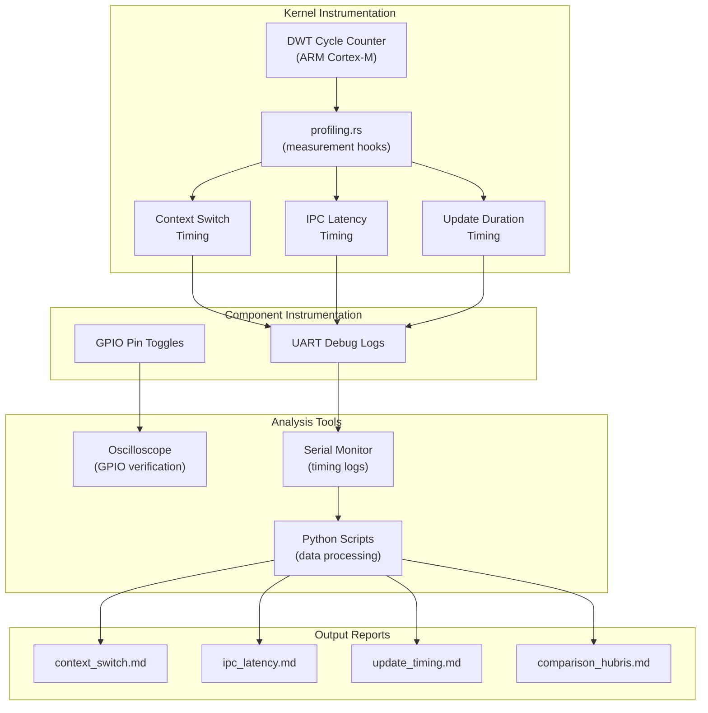
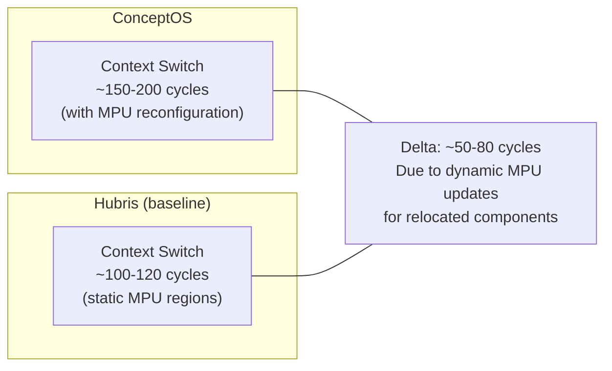

# ConceptOS — Branch: `bthermo-performance`

> **Head Commit:** `8152b12d` — "Added performance analysis"  
> **Date:** 2023-03-21  
> **Tracked Files:** 4,875  
> **Total Commits:** 254  
> **Contributor:** Andrea Aspesi (aspex2014@gmail.com)

---

## 1. Branch Information

| Property | Value |
|----------|-------|
| Branch | `bthermo-performance` |
| Head SHA | `8152b12d6f42a0adeaa73d360fea66fce9540cd1` |
| First-parent commits | 235 |
| Reachable commits | 254 |
| Ahead of main | **42** |
| Behind main | **1** (missing CBF rename) |
| Changed files vs main | **332** |
| Role | **Performance benchmarking of BThermo** |

This branch extends `bthermo-resources` with **performance measurements** — timing context switches, IPC latency, update duration, and relocation speed. It is the most feature-rich branch, containing all analysis data used in the thesis.

---

## 2. Repository Tree (Differences from `bthermo-resources`)

```text
concept-os/
├── app/
│   └── bthermo/                    # BThermo app with profiling enabled
├── sys/
│   └── kern/
│       └── src/
│           ├── profiling.rs        # [NEW/MODIFIED] Kernel profiling hooks
│           └── arch/
│               └── arm_m.rs        # [MODIFIED] Cycle counter instrumentation
├── components/
│   ├── bthermo/                    # [MODIFIED] Profiling-enabled build
│   ├── bthermo-controller/         # [MODIFIED] Timing instrumentation
│   └── ...
├── docs/
│   ├── resources/                  # Resource reports (from bthermo-resources)
│   └── performance/               # [NEW] Performance analysis reports
│       ├── context_switch.md       # Context switch timing results
│       ├── ipc_latency.md          # IPC round-trip measurements
│       ├── update_timing.md        # OTA update duration breakdown
│       ├── relocation_timing.md    # Relocation speed measurements
│       └── comparison_hubris.md    # ConceptOS vs Hubris performance
├── analysis/
│   └── hubris/
│       └── app/
│           └── stm32l476rg-mqtt/   # [MODIFIED] Hubris with profiling for comparison
└── ...
```

### Key Additions vs BThermo-Resources

| Area | Change |
|------|--------|
| `sys/kern/` | Profiling hooks in scheduler and IPC paths |
| `docs/performance/` | New directory with timing analysis reports |
| Kernel `arm_m.rs` | DWT cycle counter integration |
| Component builds | Timing instrumentation via GPIO toggles |
| Additional test data | Raw measurement CSV/data files |

---

## 3. Detailed Code Explanation

### 3.1 Kernel Profiling (`sys/kern/src/profiling.rs`)

Adds cycle-accurate measurement points in the kernel:
- **Context switch timing**: Measures cycles from PendSV entry to new task execution
- **IPC overhead**: Cycles spent in `sys_send`/`sys_recv`/`sys_reply` paths
- **KIPC timing**: Overhead of kernel IPC operations (flash alloc, install, etc.)
- **Interrupt latency**: Time from interrupt assertion to handler entry

Uses ARM Cortex-M **DWT (Data Watchpoint and Trace)** cycle counter for precise measurements.

### 3.2 Update Performance Analysis

Measures the time breakdown of a complete OTA update:

| Phase | What's Measured |
|-------|----------------|
| Reception | UART packet transfer time |
| Flash allocation | Time to find free flash region |
| Flash write | Time to write component to flash |
| Header parsing | CBF/HBF header validation |
| Relocation | Time to apply PIC relocations |
| RAM allocation | Time to allocate component RAM |
| MPU configuration | Time to set up memory protection |
| Task creation | Time to create and schedule new task |
| State transfer | Time to migrate state from old → new version |
| Old cleanup | Time to deallocate old component |

### 3.3 Comparison with Hubris

The `analysis/hubris/` fork is instrumented with the same DWT profiling to enable direct comparison:
- Context switch times: ConceptOS vs Hubris
- IPC latency: with and without MPU overhead
- Update time: full update cycle (ConceptOS only, since Hubris lacks component-level updates)

### 3.4 GPIO Profiling

Components toggle GPIO pins at specific execution points, allowing oscilloscope-based timing verification:
- Pin high → operation start
- Pin low → operation end
- Useful for validating software cycle counter measurements

---

## 4. Dependencies

Same as `bthermo-resources` (239 unique Rust dependency keys) plus:
- DWT/CoreDebug register access via `cortex-m` crate
- No additional external dependencies

---

## 5. Performance Measurement Architecture




### Update Timing Breakdown

```mermaid
gantt
    title OTA Update Timeline (typical)
    dateFormat X
    axisFormat %s

    section Reception
    UART transfer        :0, 500
    
    section Flash Operations
    Allocate flash block :500, 520
    Write to flash       :520, 800
    
    section Installation
    Parse HBF header     :800, 810
    Apply relocations    :810, 900
    Allocate RAM         :900, 910
    Configure MPU        :910, 920
    
    section Activation
    Create task          :920, 930
    State transfer       :930, 960
    Cleanup old version  :960, 980
```



### Context Switch Performance Comparison


