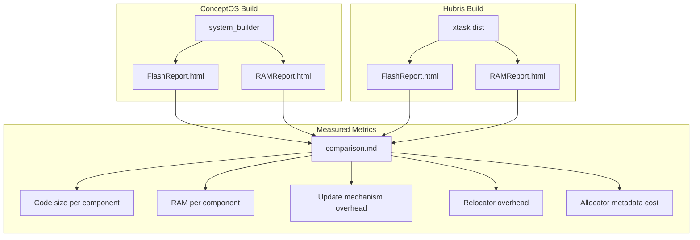
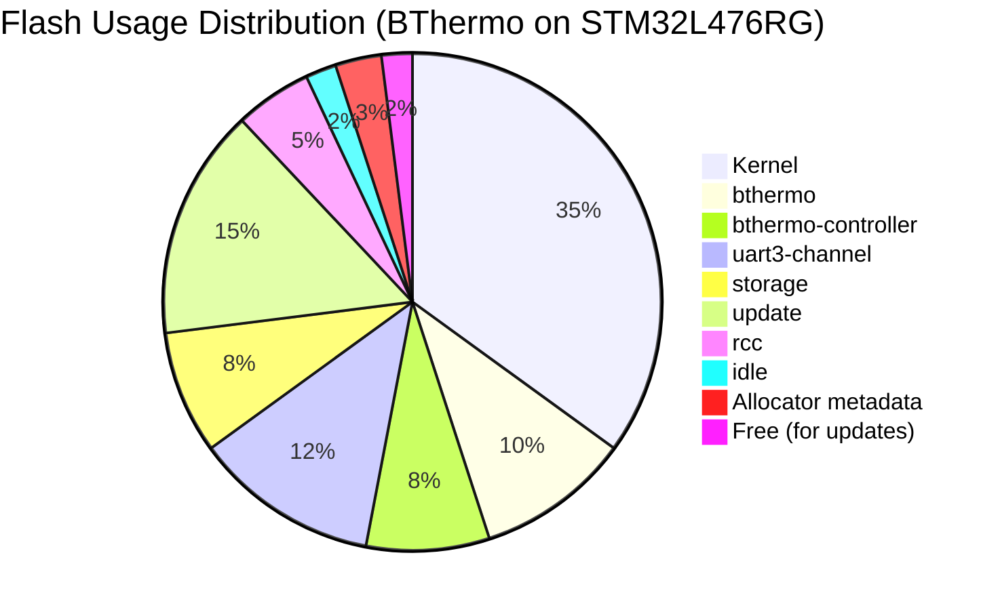

# ConceptOS — Branch: `bthermo-resources`

> **Head Commit:** `5738850c` — "Added resources analysis"  
> **Date:** 2023-03-21  
> **Tracked Files:** 4,849  
> **Total Commits:** 246  
> **Contributor:** Andrea Aspesi (aspex2014@gmail.com)

---

## 1. Branch Information

| Property | Value |
|----------|-------|
| Branch | `bthermo-resources` |
| Head SHA | `5738850c29225c8b95e6f7e3bd59dc66e3f78bab` |
| First-parent commits | 227 |
| Reachable commits | 246 |
| Ahead of main | **34** |
| Behind main | **1** (missing CBF rename) |
| Changed files vs main | **273** |
| Role | **Resource usage analysis of BThermo** |

This branch extends `bthermo` with **resource usage analysis** — measuring Flash and RAM consumption of each component to evaluate the overhead of ConceptOS's dynamic update mechanism.

---

## 2. Repository Tree (Differences from `bthermo`)

```text
concept-os/
├── app/
│   └── bthermo/                    # BThermo app (same as bthermo branch)
├── analysis/
│   └── hubris/
│       └── app/
│           └── stm32l476rg-mqtt/   # [MODIFIED] Hubris comparison app for resources
├── components/
│   ├── bthermo/                    # [MODIFIED] Resource-instrumented version
│   ├── bthermo-controller/         # [MODIFIED] Resource-instrumented version
│   └── ...
├── docs/
│   └── resources/                  # [NEW] Resource analysis reports
│       ├── FlashReport_conceptos.html
│       ├── FlashReport_hubris.html
│       ├── RAMReport_conceptos.html
│       ├── RAMReport_hubris.html
│       └── comparison.md           # Side-by-side resource comparison
└── ...
```

### Key Additions vs BThermo

| Area | Change |
|------|--------|
| `docs/resources/` | New directory with HTML resource reports |
| Component builds | Instrumented with size tracking |
| Analysis apps | Hubris MQTT app configured for resource comparison |
| Additional data files | Flash/RAM usage breakdowns per component |

---

## 3. Detailed Code Explanation

### 3.1 Resource Analysis Methodology

This branch adds instrumentation to compare **ConceptOS** vs **vanilla Hubris** resource usage:

- **Flash usage**: Measures code (`.text`), read-only data (`.rodata`), and relocations per component
- **RAM usage**: Measures stack, BSS, and data sections per component
- **Overhead analysis**: Quantifies the extra flash/RAM cost of:
  - CBF/HBF headers
  - Relocation tables
  - Flash allocator metadata
  - RAM allocator overhead
  - Update component footprint

### 3.2 Resource Reports

Generated HTML reports (`FlashReport.html`, `RAMReport.html`) provide visual breakdowns of:
- Per-component flash occupancy
- Per-component RAM allocation
- Kernel overhead
- Free space available for dynamic updates

### 3.3 Comparison with Hubris

The `analysis/hubris/app/stm32l476rg-mqtt/` directory contains a modified Hubris build targeting the same STM32L476RG board with equivalent functionality, enabling direct resource comparison.

---

## 4. Dependencies

Same as `bthermo` branch — 239 unique Rust dependency keys, with the addition of analysis-specific Python scripts for resource measurement.

---

## 5. Resource Analysis Architecture



### Component Resource Breakdown



