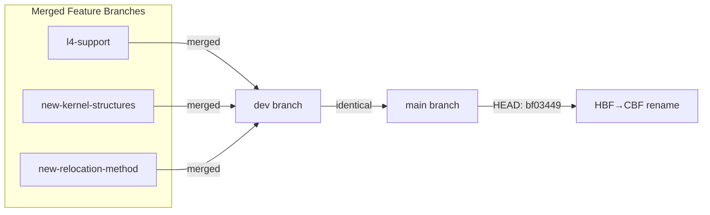

# ConceptOS — Branch: `dev`

> **Head Commit:** `bf034494` — "Breaking: renaming HBF to CBF for clarity's sake"  
> **Date:** 2023-03-21  
> **Tracked Files:** 4,819  
> **Total Commits:** 213  
> **Contributor:** Andrea Aspesi (aspex2014@gmail.com)

---

## 1. Branch Information

| Property | Value |
|----------|-------|
| Branch | `dev` |
| Head SHA | `bf034494815f47f2ac6ab6a6fdb9144b43b7c940` |
| First-parent commits | 205 |
| Reachable commits | 213 |
| Ahead of main | 0 |
| Behind main | 0 |
| Changed files vs main | 0 |
| Role | **Development branch (merged into main)** |

> [!NOTE]
> The `dev` branch is **identical** to `main` at this snapshot. All development from `dev` was merged into `main`, and both branches point to the same commit (`bf03449`). This is the final state after the HBF → CBF rename.

---

## 2. Repository Tree

The repository tree is identical to `main`. See [branch_main.md](branch_main.md) for the full tree.

---

## 3. Detailed Code Explanation

All code is identical to `main`. See [branch_main.md](branch_main.md) for complete explanations of every subsystem:
- `sys/` — Microkernel, ABI, userlib
- `components/` — idle, rcc, storage, uart-channel, update, test_a, test_b
- `libs/` — flash_allocator, ram_allocator, buddy_allocator, cbf_lite, cbf_rs, relocator, unwrap-lite
- `toolchain/` — component_builder, system_builder, elf2cbf, update_tool, relocation scripts
- `boards/` — stm32f303re, stm32l432kc, stm32l476rg
- `app/` — stm32f303re_demo, stm32f303re_mqtt, stm32l432kc_demo, stm32l476rg_demo
- `analysis/` — Hubris and Humility forks
- `utils/` — mqtt_adapter

---

## 4. Dependencies

Identical to `main` — 156 Cargo manifests, 238 unique Rust dependency keys. See [branch_main.md](branch_main.md#4-dependencies-among-files).

---

## 5. Architecture Diagram

### Development Timeline

The `dev` branch served as the integration branch where all feature branches were merged:

1. `new-kernel-structures` → merged into `dev` (2023-02-23)
2. `new-relocation-method` → merged into `dev` (2023-02-23)
3. `l4-support` → merged into `dev` (2023-02-23)
4. Final refinements (UART multiplex, CRC validation, dual-bank updates, context-switch profiling)
5. HBF → CBF rename (2023-03-21) — final commit before merge to `main`
