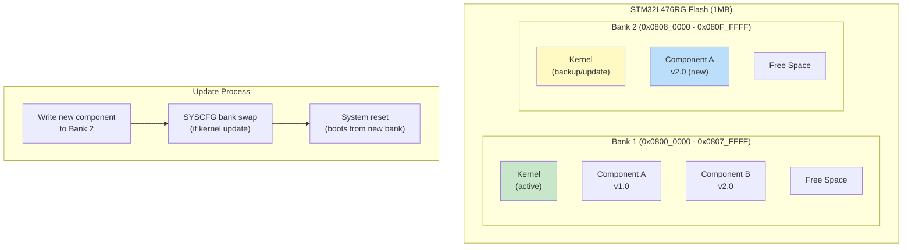
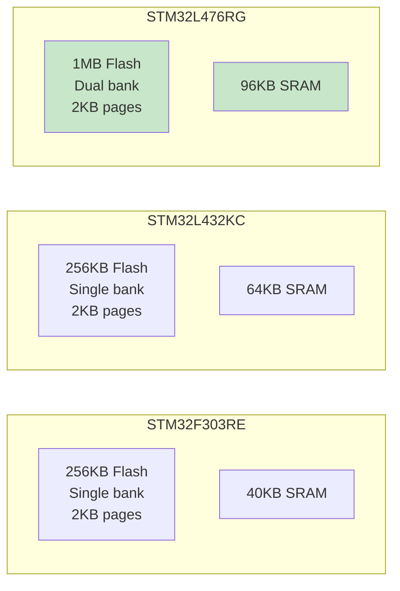

# ConceptOS — Branch: `l4-support`

> **Head Commit:** `3ffae93d` — "Added support for stm32l476rg"  
> **Date:** 2023-02-23  
> **Tracked Files:** 4,819  
> **Total Commits:** 188  
> **Contributor:** Andrea Aspesi (aspex2014@gmail.com)

---

## 1. Branch Information

| Property | Value |
|----------|-------|
| Branch | `l4-support` |
| Head SHA | `3ffae93d1b5eb94302224129b22f5b6e6f540e31` |
| Reachable commits | 188 |
| Ahead of main | **0** |
| Behind main | **25** |
| Changed files vs main | **0** |
| Role | **STM32L4 board support feature branch** |

> [!NOTE]
> This branch was **fully merged** into `dev` (and subsequently `main`). It has 0 changed files vs main because all its changes are included in main. It is 25 commits behind main due to subsequent commits made after the merge.

---

## 2. Purpose & Scope

The `l4-support` branch introduced support for the **STM32L476RG** microcontroller — a Cortex-M4 with 1MB dual-bank flash. This was a critical feature because dual-bank flash enables **bank-swap updates**, a more robust OTA mechanism.

### What This Branch Added

1. **Board support package** for STM32L476RG:
   - `boards/stm32l476rg/Board.toml` — Memory map with dual-bank flash configuration
   - `boards/stm32l476rg/src/` — Peripheral Access Crate (PAC) from SVD
   - `boards/stm32l476rg/kernel-link.x` — Linker script for L476RG memory layout
   - `boards/stm32l476rg/build.rs` — Build script for memory region generation

2. **Kernel modifications** for dual-bank flash:
   - Flash erase/write routines for STM32L4 flash controller (different register layout than F3)
   - Bank swap support via SYSCFG/FLASH option bytes
   - Larger flash page handling (2KB pages vs 2KB on F303)

3. **Application configuration**:
   - `app/stm32l476rg_demo/` — Demo application for STM32L476RG
   - Board-specific peripheral region definitions

4. **Hubris fork updates**:
   - `analysis/hubris/` — Added STM32L476RG support to the Hubris fork for comparison testing

---

## 3. Detailed Code Explanation

### 3.1 STM32L476RG Board Configuration

**`Board.toml`** defines the dual-bank memory layout:

```toml
[flash]
base = 0x08000000
size = 1048576        # 1MB total flash
page_size = 2048      # 2KB pages
bank2_offset = 524288 # Bank 2 starts at 512KB

[ram]
base = 0x20000000
size = 98304          # 96KB SRAM

[peripherals]
# STM32L4-specific peripheral base addresses
```

### 3.2 Dual-Bank Flash Support

The STM32L476RG has two independent flash banks of 512KB each. This enables:

- **Bank-swap updates**: Write new kernel to bank 2 while running from bank 1, then swap
- **Safer updates**: If bank 2 update fails, bank 1 remains intact
- **Parallel operation**: Read from one bank while erasing/writing the other

### 3.3 PAC (Peripheral Access Crate)

The `src/` directory contains auto-generated register definitions from the STM32L476RG SVD file, providing type-safe access to:
- Flash controller (FLASH)
- Reset and Clock Control (RCC)
- USART peripherals
- GPIO ports
- I2C interfaces
- System configuration (SYSCFG) for bank swapping

---

## 4. Dependencies

Same dependency set as main, with the addition of:
- `stm32l4` — STM32L4 PAC crate
- `stm32l476rg` — Board-specific crate (local)

---

## 5. Architecture — Dual-Bank Updates



### Board Comparison


