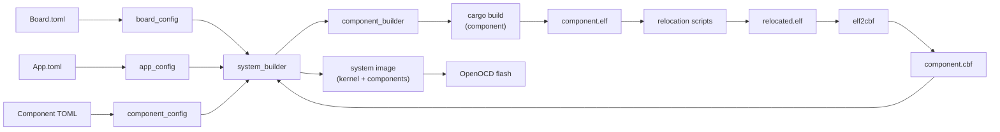
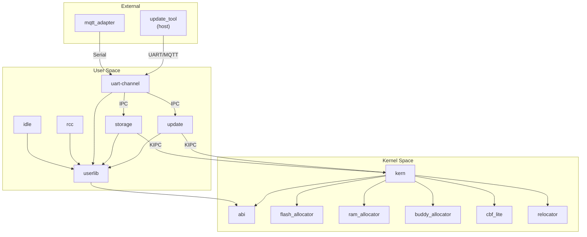
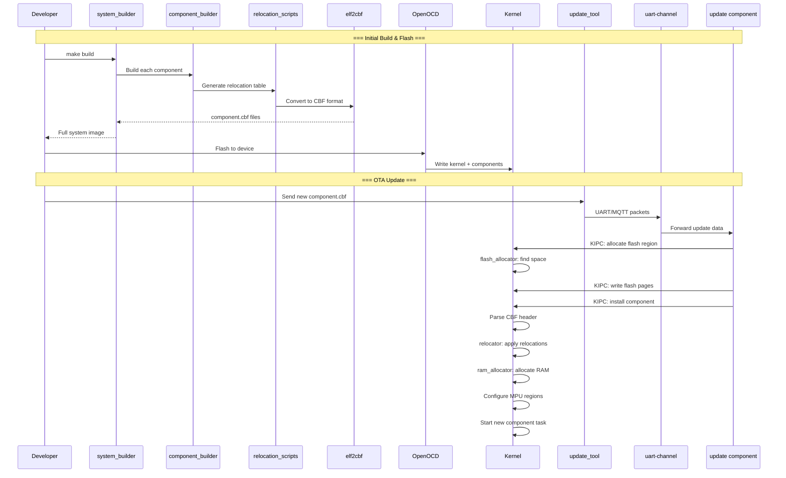

# ConceptOS — Branch: `main`

> **Head Commit:** `bf034494` — "Breaking: renaming HBF to CBF for clarity's sake"  
> **Date:** 2023-03-21  
> **Tracked Files:** 4,819  
> **Total Commits:** 213  
> **Contributor:** Andrea Aspesi (aspex2014@gmail.com)

---

## 1. Branch Information

| Property | Value |
|----------|-------|
| Branch | `main` |
| Head SHA | `bf034494815f47f2ac6ab6a6fdb9144b43b7c940` |
| First-parent commits | 205 |
| Reachable commits (with merges) | 213 |
| Ahead of main | 0 |
| Behind main | 0 |
| Role | **Production / baseline branch** |

This is the primary branch of ConceptOS. It contains the complete, stable implementation of the micro-kernel OS with OTA update support. Key milestone: renamed HBF (Hubris Binary Format) to CBF (ConceptOS Binary Format) for clarity.

---

## 2. Repository Tree

```text
concept-os/
├── .gitignore
├── Dockerfile                    # Docker build environment
├── LICENSE                       # GPL-3.0
├── Makefile                      # Top-level build orchestration
├── README.md                     # Project overview
├── rust-toolchain.toml           # Rust nightly toolchain pinning
├── analysis/                     # (2389 files) Hubris + Humility forks for comparison
│   ├── hubris/                   # Forked Hubris OS for baseline analysis
│   └── humility/                 # Forked Humility debugger
├── app/                          # (30 files) Application compositions
│   ├── stm32f303re_demo/         # Demo app for STM32F303RE
│   ├── stm32f303re_mqtt/         # MQTT-enabled app for STM32F303RE
│   ├── stm32l432kc_demo/         # Demo app for STM32L432KC
│   └── stm32l476rg_demo/         # Demo app for STM32L476RG
├── boards/                       # (2007 files) Board support packages
│   ├── link_component.x          # Linker script for components
│   ├── stm32f303re/              # Board config + PAC for F303RE
│   ├── stm32l432kc/              # Board config + PAC for L432KC
│   └── stm32l476rg/              # Board config + PAC for L476RG
├── components/                   # (61 files) User-space task components
│   ├── idle/core/                # Idle task (lowest priority)
│   ├── rcc/                      # Reset & Clock Control (api + core)
│   ├── storage/                  # Flash storage management (api + core)
│   ├── test_a/core/              # Test component A
│   ├── test_b/                   # Test component B (api + core)
│   ├── uart-channel/             # Serial communication channel (api + core)
│   └── update/core/              # OTA update component
├── docs/                         # (32 files) Specifications and design documents
│   ├── ComponentIdentifiers.md
│   ├── FlashMemory.md
│   ├── KernelUpdateSupport.md
│   ├── RAMMemory.md
│   ├── SerialChannel.md
│   ├── images/                   # SVG/PNG diagrams
│   └── toolchain/                # Component spec, CBF format, PIC docs
├── libs/                         # (75 files) Reusable no_std libraries
│   ├── buddy_allocator/          # Buddy allocator for flash pages
│   ├── cbf_lite/                 # Lightweight CBF reader (no_std)
│   ├── cbf_rs/                   # Full CBF reader/writer (std, host)
│   ├── flash_allocator/          # Flash memory allocator with VFP
│   ├── ram_allocator/            # RAM allocator for component memory
│   ├── relocator/                # ELF relocation engine
│   └── unwrap-lite/              # Panic-free unwrap for no_std
├── sys/                          # (34 files) Core OS system crates
│   ├── abi/                      # ABI types, CBF header, syscall numbers
│   ├── kern/                     # Microkernel (scheduler, MPU, IPC, update)
│   └── userlib/                  # User-space syscall wrappers
├── toolchain/                    # (151 files) Host-side build tools
│   ├── libs/                     # Config parsing (app, board, component TOML)
│   ├── modules/
│   │   ├── component_builder/    # Builds individual components
│   │   ├── elf2cbf/              # Converts ELF → CBF format (Python)
│   │   ├── system_builder/       # Builds full system image
│   │   └── update_tool/          # Sends updates via UART or MQTT
│   └── scripts/relocations/      # Position-independent code relocation
└── utils/                        # (34 files) Auxiliary utilities
    └── mqtt_adapter/             # MQTT ↔ Serial bridge (Python)
```

### File Distribution

| Extension | Count | Description |
|-----------|------:|-------------|
| `.rs` | 4,288 | Rust source code |
| `.toml` | 208 | Cargo/config manifests |
| `.gitignore` | 56 | Git ignore rules |
| `.idol` | 33 | Hubris IPC interface definitions |
| `.py` | 29 | Python scripts (elf2cbf, relocations, mqtt) |
| `.md` | 24 | Documentation |
| `.x` | 19 | Linker scripts |
| `.svg` | 13 | Vector diagrams |

---

## 3. Detailed Code Explanation by Subsystem

### 3.1 `sys/` — Core OS System

#### `sys/abi/` — Application Binary Interface
Defines shared types between the kernel and user-space:
- **CBF header structures** (`CbfHeaderBase`, `CbfHeaderMain`): The binary format used for component images stored in flash
- **Syscall numbers** and error codes
- **Task descriptors** and IPC message types
- **Flash block headers** for the allocator metadata

#### `sys/kern/` — Microkernel
The heart of ConceptOS — a priority-preemptive microkernel for Cortex-M:
- **Scheduler** (`task.rs`): Round-robin within priority levels, context switching via PendSV
- **MPU management**: Hardware memory protection per component
- **IPC subsystem**: Synchronous message-passing between components (send/receive/reply)
- **KIPC (Kernel IPC)**: Special kernel calls for flash operations, component management
- **Update engine**: Handles component installation, relocation, state transfer, and rollback
- **Flash interface**: Direct flash erase/write for component storage
- **Startup** (`start.rs`): Vector table setup, clock init, initial component loading

#### `sys/userlib/` — User-Space Library
Runtime library linked into every component:
- **Syscall wrappers**: `sys_send()`, `sys_recv()`, `sys_reply()`, `sys_borrow_read/write()`
- **Task discovery**: Find peer tasks by name
- **Lease management**: Shared memory regions between tasks
- **Panic handler**: Safe panic that doesn't bring down other components

### 3.2 `components/` — User-Space Tasks

Each component follows the pattern: `core/` (implementation) + optional `api/` (IPC client wrapper).

| Component | Purpose |
|-----------|---------|
| `idle` | Lowest-priority task; runs WFI when nothing else is ready |
| `rcc` | Manages clock tree configuration on STM32 |
| `storage` | Flash storage read/write; exposes API for other components |
| `uart-channel` | Multiplexed UART serial channel for update/debug communication |
| `update` | Receives OTA update packets, writes to flash, triggers kernel install |
| `test_a` / `test_b` | Test components for development and validation |

### 3.3 `libs/` — Shared Libraries

| Library | Type | Purpose |
|---------|------|---------|
| `flash_allocator` | no_std | Manages flash memory using Variable-Fixed Partition (VFP) scheme with buddy allocator for metadata tracking |
| `ram_allocator` | no_std | Allocates SRAM regions for component BSS/data/stack |
| `buddy_allocator` | no_std | Generic buddy allocator used as building block |
| `cbf_lite` | no_std | Lightweight parser for CBF (ConceptOS Binary Format) headers on-device |
| `cbf_rs` | std | Full-featured CBF reader/writer for host tools |
| `relocator` | no_std | Applies ELF relocations to position-independent component code at load time |
| `unwrap-lite` | no_std | `unwrap_lite()` — panics without formatting to save flash space |

### 3.4 `boards/` — Board Support Packages

Each board directory contains:
- `Board.toml` — Memory map, flash/RAM regions, peripheral addresses
- `Cargo.toml` — Board-specific crate with PAC (Peripheral Access Crate)
- `kernel-link.x` — Linker script for kernel placement
- `build.rs` — Build script that generates memory layout from `Board.toml`
- `src/` — PAC register definitions (auto-generated from SVD)

Supported boards: **STM32F303RE**, **STM32L432KC**, **STM32L476RG**

### 3.5 `app/` — Application Compositions

Each app directory is a top-level build target:
- `App.toml` — Declares which components to include + their priorities, memory allocation
- `Cargo.toml` — Workspace root for the app build
- `Makefile` — Build commands (invokes `system_builder`)
- `src/main.rs` — Minimal kernel entry point
- `FlashReport.html` / `RAMReport.html` — Generated memory usage visualizations

### 3.6 `toolchain/` — Host Build Tools

| Module | Language | Purpose |
|--------|----------|---------|
| `component_builder` | Rust | Compiles a single component: cargo build → relocation → elf2cbf |
| `system_builder` | Rust | Orchestrates full system build: kernel + all components → flash image |
| `elf2cbf` | Python | Converts relocated ELF into CBF binary format |
| `update_tool` | Rust | Sends CBF binaries to device via UART or MQTT for OTA updates |
| `scripts/relocations` | Python | Generates PIC (Position-Independent Code) relocation tables |
| `libs/app_config` | Rust | Parses `App.toml` files |
| `libs/board_config` | Rust | Parses `Board.toml` files |
| `libs/component_config` | Rust | Parses component configuration TOML |

### 3.7 `analysis/` — Comparison Artifacts

Contains forks of **Hubris** (Oxide Computer's RTOS) and **Humility** (its debugger) used for performance comparison and analysis in the thesis work. These are snapshots of the upstream repositories with minor modifications for STM32L4/F3 targets.

### 3.8 `utils/` — Auxiliary Tools

- `mqtt_adapter/` — Python bridge that connects MQTT broker to serial port, enabling OTA updates over network

---

## 4. Dependencies Among Files

### Build-time Dependency Flow



### Runtime Dependency Flow



### Crate Dependency Summary

- **156 Cargo manifests** define Rust crate dependencies
- **238 unique Rust crate keys** across the workspace
- Key internal dependencies: `abi`, `userlib`, `flash_allocator`, `ram_allocator`, `buddy_allocator`, `cbf_lite`, `cbf_rs`, `relocator`, `board_config`, `app_config`, `component_config`
- Key external dependencies: `cortex-m`, `cortex-m-rt`, `serde`, `toml`, `clap`, `serialport`, `rumqttc`

### Python Dependencies

| Tool | Dependencies |
|------|-------------|
| `elf2cbf` | *(none)* |
| `relocation scripts` | `lief`, `pyelftools`, `pyserde`, `toml`, `tomli`, `tomli_w` |
| `mqtt_adapter` | `loguru`, `pyserial`, `PyYAML`, `ujson` |

---

## 5. System Workflow — How Everything Works Together


