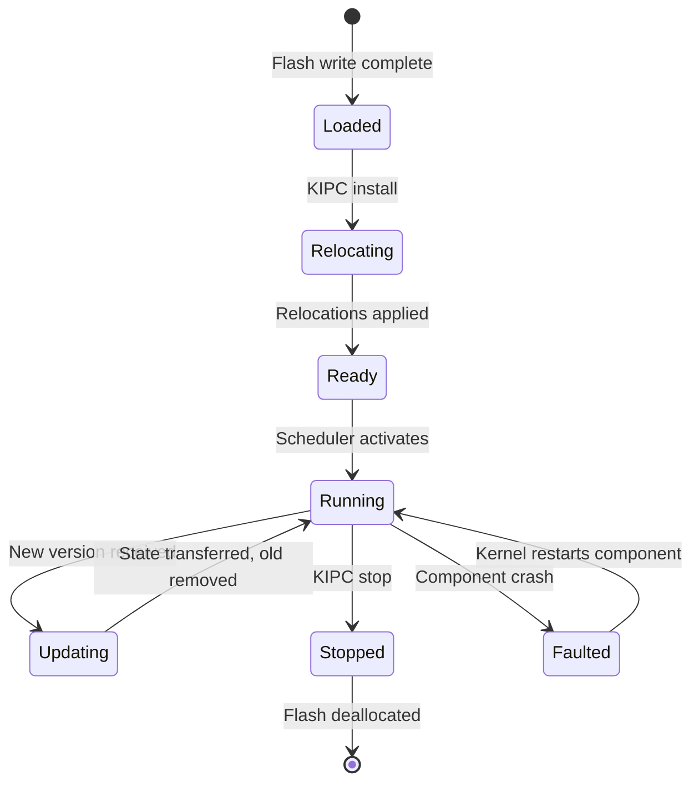
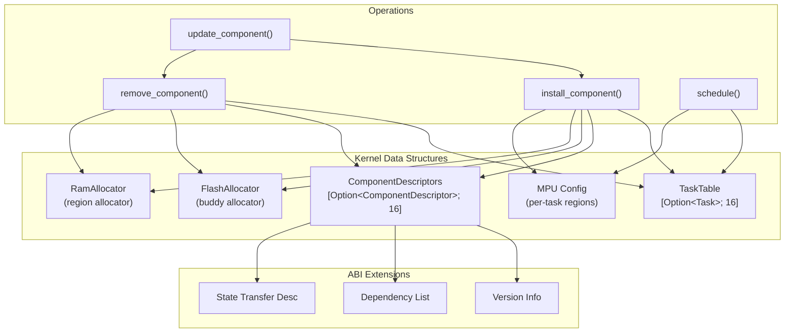
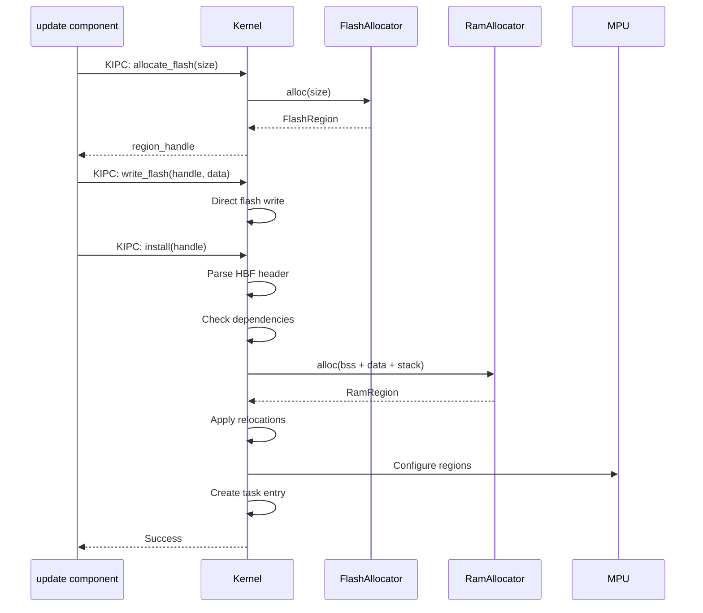

# ConceptOS — Branch: `new-kernel-structures`

> **Head Commit:** `8bb933a9` — "Optimizations thanks to profiling"  
> **Date:** 2023-02-19  
> **Tracked Files:** 4,819  
> **Total Commits:** 190  
> **Contributor:** Andrea Aspesi (aspex2014@gmail.com)

---

## 1. Branch Information

| Property | Value |
|----------|-------|
| Branch | `new-kernel-structures` |
| Head SHA | `8bb933a97b17803d1d16a5ed8a759cd0489928c5` |
| Reachable commits | 190 |
| Ahead of main | **0** |
| Behind main | **27** |
| Changed files vs main | **0** |
| Role | **Kernel data structure redesign** |

> [!NOTE]
> This branch was **fully merged** into `dev`/`main`. All its changes are present in main. It is 27 commits behind due to subsequent development.

---

## 2. Purpose & Scope

The `new-kernel-structures` branch redesigned the kernel's internal data structures to support **dynamic component management** more efficiently. The original Hubris kernel used static arrays sized at compile time; ConceptOS needed dynamic structures for runtime component installation/removal.

### What This Branch Changed

1. **Task table redesign** (`sys/kern/src/task.rs`):
   - Changed from fixed-size array to dynamic structure supporting runtime task addition/removal
   - Doubled supported task count (8 → 16 tasks)
   - Added task state for "pending install" and "pending removal"

2. **Memory region tracking** (`sys/kern/src/`):
   - New data structures for tracking dynamically allocated flash regions per component
   - RAM region descriptors that can be reclaimed on component removal
   - MPU region mapping that updates when components are relocated

3. **Component metadata** (`sys/abi/src/`):
   - Extended ABI with component version information
   - Added dependency tracking structures (component A depends on component B)
   - State transfer descriptors for update continuity

4. **Flash allocator integration** (`sys/kern/`):
   - Kernel-side interface to the flash allocator library
   - Flash block management structures
   - Garbage collection metadata for removed components

5. **Optimizations from profiling**:
   - Reduced memory copies in IPC path
   - Optimized MPU region calculation
   - Faster task lookup via index tables

---

## 3. Detailed Code Explanation

### 3.1 Dynamic Task Table

**Before (Hubris):**
```rust
// Fixed at compile time
static TASKS: [Task; NUM_TASKS] = [...];
```

**After (ConceptOS):**
```rust
// Dynamic task management
struct TaskTable {
    tasks: [Option<Task>; MAX_TASKS],  // Slots can be empty
    active_count: usize,
    generation: u32,  // Incremented on structural changes
}
```

### 3.2 Component Lifecycle States




### 3.3 Memory Layout Structures

```rust
struct ComponentDescriptor {
    id: ComponentId,
    version: u32,
    flash_region: FlashRegion,    // Where code lives in flash
    ram_region: RamRegion,        // Allocated SRAM
    mpu_regions: [MpuRegion; 4],  // Hardware protection config
    entry_point: usize,           // Relocated entry address
    dependencies: [ComponentId; MAX_DEPS],
    state_transfer: Option<StateDescriptor>,
}
```

### 3.4 Dependency Graph

Components can declare dependencies on other components. The kernel enforces:
- A component cannot be removed if others depend on it
- Updates check dependency compatibility before installation
- Circular dependencies are rejected at build time

---

## 4. Dependencies

Same as main — 238 unique Rust dependency keys. No additional external dependencies introduced by this branch.

---

## 5. Kernel Structure Diagram



### Memory Management Flow


