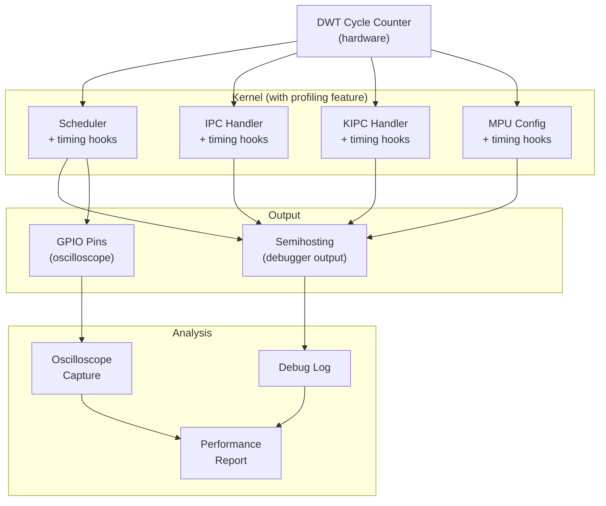
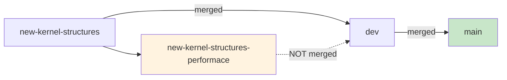

# ConceptOS — Branch: `new-kernel-structures-performace`

> **Head Commit:** `ecbf917e` — "Performance profiling for kernel structures"  
> **Date:** 2023-02-19  
> **Tracked Files:** 4,842  
> **Total Commits:** 192  
> **Contributor:** Andrea Aspesi (aspex2014@gmail.com)

---

## 1. Branch Information

| Property | Value |
|----------|-------|
| Branch | `new-kernel-structures-performace` |
| Head SHA | `ecbf917e...` |
| Reachable commits | 192 |
| Ahead of main | **2** |
| Behind main | **28** |
| Changed files vs main | **23** |
| Role | **Performance profiling for new kernel structures** |

> [!IMPORTANT]
> Note the typo in the branch name: "performace" instead of "performance". This branch extends `new-kernel-structures` with 2 additional commits focused on profiling and was **not** merged into main.

---

## 2. Purpose & Scope

This branch adds **performance measurement infrastructure** specifically for evaluating the new kernel data structures introduced in `new-kernel-structures`. It quantifies the overhead of dynamic task management vs Hubris's static approach.

### What This Branch Added (2 commits ahead of main)

1. **DWT cycle counter profiling** in kernel hot paths:
   - Task lookup time (with dynamic table vs static array)
   - MPU reconfiguration time (for relocated components)
   - IPC dispatch overhead (with dependency checking)

2. **Measurement output via semihosting**:
   - Cycle counts printed via ARM semihosting for debugger capture
   - Statistical aggregation (min/max/avg over N samples)

### Changed Files (23 files)

The 23 changed files span:
- `sys/kern/src/` — Profiling instrumentation in scheduler, IPC, and MPU code
- `sys/kern/Cargo.toml` — Added optional `profiling` feature flag
- `boards/stm32f303re/` — Board-specific profiling GPIO configuration
- `app/stm32f303re_demo/` — Demo app with profiling enabled

---

## 3. Detailed Code Explanation

### 3.1 Profiling Hooks

```rust
// In sys/kern/src/task.rs
#[cfg(feature = "profiling")]
fn lookup_task(&self, id: TaskId) -> &Task {
    let start = dwt::cycle_count();
    let task = self.tasks[id.index()].as_ref().unwrap();
    let elapsed = dwt::cycle_count() - start;
    profiling::record("task_lookup", elapsed);
    task
}
```

### 3.2 Measurement Points

| Measurement | Location | What's Timed |
|-------------|----------|-------------|
| `task_lookup` | `task.rs` | Finding task in dynamic array |
| `mpu_reconfig` | `arch/arm_m.rs` | Setting up MPU for task switch |
| `ipc_dispatch` | `syscalls.rs` | Routing IPC to correct task |
| `dep_check` | `kipc.rs` | Dependency validation on update |
| `ctx_switch_total` | `arch/arm_m.rs` | Full PendSV handler time |

### 3.3 Feature Flag

Profiling is gated behind a Cargo feature to avoid overhead in release builds:

```toml
[features]
profiling = []  # Enables DWT cycle counter instrumentation
```

---

## 4. Dependencies

Same as `new-kernel-structures` (238 keys) plus:
- `cortex-m` with DWT feature enabled
- `cortex-m-semihosting` for debug output

---

## 5. Profiling Architecture



### Relationship to Other Branches


