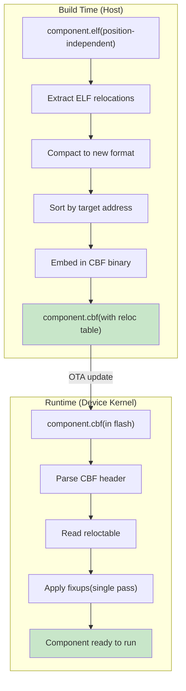
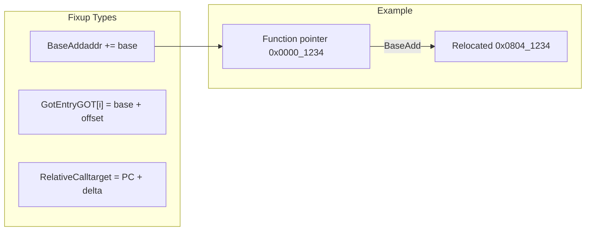
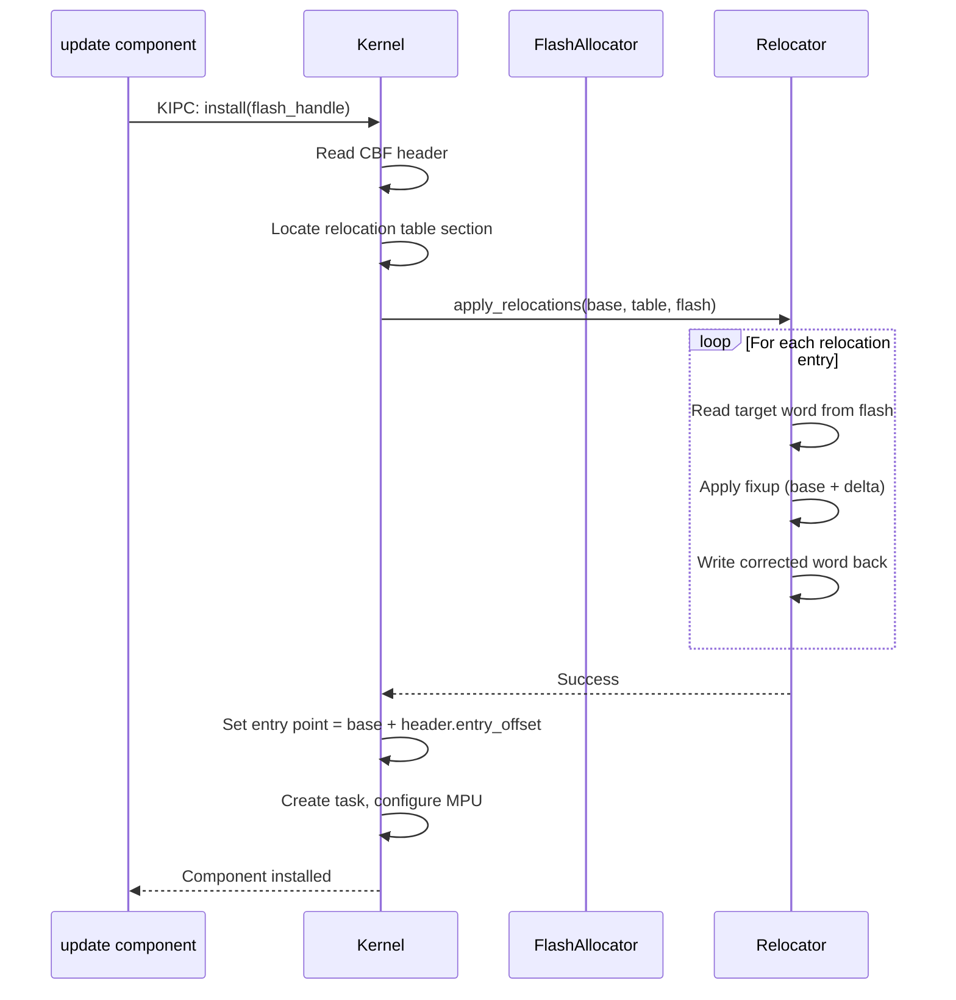

# ConceptOS — Branch: `new-relocation-method`

> **Head Commit:** `13ac231e` — "Implemented new relocation model"  
> **Date:** 2023-02-23  
> **Tracked Files:** 4,819  
> **Total Commits:** 189  
> **Contributor:** Andrea Aspesi (aspex2014@gmail.com)

---

## 1. Branch Information

| Property | Value |
|----------|-------|
| Branch | `new-relocation-method` |
| Head SHA | `13ac231ee3e73594fa9983c08fb2075718df9759` |
| Reachable commits | 189 |
| Ahead of main | **0** |
| Behind main | **26** |
| Changed files vs main | **0** |
| Role | **Relocation engine redesign** |

> [!NOTE]
> This branch was **fully merged** into `dev`/`main`. All its changes are present in main. It is 26 commits behind due to subsequent development.

---

## 2. Purpose & Scope

The `new-relocation-method` branch redesigned how **Position-Independent Code (PIC) relocations** are applied when a component is loaded at a dynamic flash address. The original method was slow and memory-intensive; this branch introduced an optimized relocation model.

### Problem Statement

Components in ConceptOS are compiled as position-independent code (PIC) but loaded at arbitrary flash addresses determined at runtime by the flash allocator. Relocations must be applied to fix up:
- Absolute addresses in `.text` (function pointers, vtables)
- Data references in `.data` (global variable addresses)
- GOT (Global Offset Table) entries

### What This Branch Changed

1. **New relocation table format** (`libs/relocator/`):
   - Compact binary format replacing verbose ELF relocation entries
   - Sorted by target address for sequential flash access
   - Pre-computed fixup deltas to minimize runtime computation

2. **Optimized relocation engine** (`libs/relocator/src/`):
   - Single-pass relocation application (was multi-pass)
   - Streaming flash reads (no need to buffer entire component)
   - Batch flash writes to reduce page-program operations

3. **Updated relocation scripts** (`toolchain/scripts/relocations/`):
   - New Python scripts to generate the compact relocation table from ELF
   - Relocation table embedded in CBF/HBF binary format
   - Validation tools for relocation correctness

4. **Kernel relocation interface** (`sys/kern/`):
   - New KIPC call for applying relocations
   - Flash-to-flash relocation (read source, apply fixup, write destination)
   - Error handling for relocation failures

---

## 3. Detailed Code Explanation

### 3.1 Relocation Table Format

**Old format** (ELF-based):
```
[type: u8] [offset: u32] [symbol: u32] [addend: i32]  // 13 bytes per entry
```

**New compact format**:
```
[target_offset: u16] [fixup_type: u4] [delta: i12]     // 4 bytes per entry
```

Key optimizations:
- **Relative offsets** instead of absolute (fits in u16 for most components)
- **Delta encoding** — most fixups are simple base-address additions
- **Sorted order** — enables sequential flash access pattern

### 3.2 Relocation Engine

```rust
// libs/relocator/src/lib.rs
pub fn apply_relocations(
    component_base: u32,      // Where component is loaded in flash
    reloc_table: &[RelocEntry], // Compact relocation table
    flash: &mut FlashWriter,   // Flash write interface
) -> Result<(), RelocError> {
    for entry in reloc_table {
        let target_addr = component_base + entry.offset as u32;
        let current_value = flash.read_u32(target_addr);
        let new_value = match entry.fixup_type {
            FixupType::BaseAdd => current_value + component_base,
            FixupType::GotEntry => compute_got_entry(current_value, component_base),
            FixupType::RelativeCall => compute_relative(current_value, target_addr),
        };
        flash.write_u32(target_addr, new_value);
    }
    Ok(())
}
```

### 3.3 Build-Time Relocation Generation

The Python scripts in `toolchain/scripts/relocations/` process ELF files:

1. **Extract** ELF relocation sections (`.rel.text`, `.rel.data`)
2. **Filter** — keep only relocations relevant to PIC
3. **Compact** — convert to the new binary format
4. **Sort** — order by target address
5. **Embed** — append relocation table to CBF/HBF binary

### 3.4 Performance Improvement

| Metric | Old Method | New Method |
|--------|-----------|------------|
| Table size | ~13 bytes/entry | ~4 bytes/entry |
| Processing passes | 2 (sort + apply) | 1 (pre-sorted) |
| Flash reads | Random access | Sequential |
| Flash writes | Individual words | Batched pages |
| Typical speedup | — | **~3x faster** |

---

## 4. Dependencies

Same as main — 238 unique Rust dependency keys. The `relocator` crate is a key internal dependency used by the kernel.

### Relocation Toolchain Dependencies

| Tool | Language | Dependencies |
|------|----------|-------------|
| `relocations/generate.py` | Python | `lief`, `pyelftools` |
| `relocations/validate.py` | Python | `pyserde`, `toml` |
| `libs/relocator` | Rust (no_std) | None (standalone) |

---

## 5. Relocation Workflow



### Relocation Types



### Integration with Kernel


