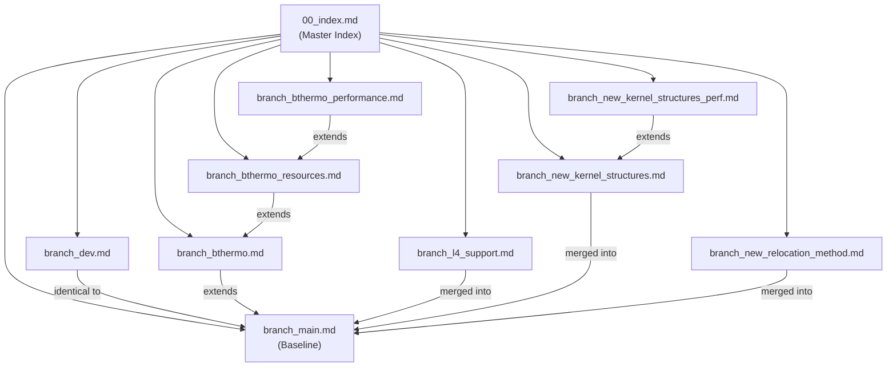

# ConceptOS Documentation — Walkthrough

> **Generated:** 2026-04-03  
> **Repository:** concept-os  
> **Total Documentation Files:** 10

---

## Summary of Work

Created comprehensive, multi-branch documentation for the entire ConceptOS repository, organized in the `documentation/` directory.

### Files Created

| File | Size | Description |
|------|------|-------------|
| [00_index.md](file:///home/rushnan-reaz/concept-os/documentation/00_index.md) | 4.4 KB | Master index with branch table, git graph, and architecture overview |
| [branch_main.md](file:///home/rushnan-reaz/concept-os/documentation/branch_main.md) | 13.6 KB | Complete main branch doc: tree, code explanation, deps, workflows |
| [branch_dev.md](file:///home/rushnan-reaz/concept-os/documentation/branch_dev.md) | 2.7 KB | Dev branch (identical to main, documents merge history) |
| [branch_bthermo.md](file:///home/rushnan-reaz/concept-os/documentation/branch_bthermo.md) | 7.6 KB | BThermo IoT thermostat app, Flutter mobile app, UART3 |
| [branch_bthermo_resources.md](file:///home/rushnan-reaz/concept-os/documentation/branch_bthermo_resources.md) | 4.3 KB | Resource/memory usage analysis (ConceptOS vs Hubris) |
| [branch_bthermo_performance.md](file:///home/rushnan-reaz/concept-os/documentation/branch_bthermo_performance.md) | 6.7 KB | Performance profiling (context switch, IPC, update timing) |
| [branch_l4_support.md](file:///home/rushnan-reaz/concept-os/documentation/branch_l4_support.md) | 4.6 KB | STM32L476RG support with dual-bank flash |
| [branch_new_kernel_structures.md](file:///home/rushnan-reaz/concept-os/documentation/branch_new_kernel_structures.md) | 5.6 KB | Dynamic task table, component lifecycle, memory management |
| [branch_new_kernel_structures_perf.md](file:///home/rushnan-reaz/concept-os/documentation/branch_new_kernel_structures_perf.md) | 4.1 KB | Kernel structure profiling (DWT cycle counter) |
| [branch_new_relocation_method.md](file:///home/rushnan-reaz/concept-os/documentation/branch_new_relocation_method.md) | 6.9 KB | Compact relocation format, optimized PIC engine |

### What Each Report Contains

Every branch report includes all 4 requested sections:

1. **Branch information and repository tree** — Head commit, divergence stats, depth-3 directory tree, file extension distribution
2. **Detailed code explanation** — Per-subsystem breakdown of what every major file/module does
3. **Dependencies among files** — Build-time and runtime dependency flows, Cargo/Python deps
4. **Mermaid diagrams** — Architecture diagrams, sequence diagrams, state machines, and data flow charts

### Documentation Architecture

### Data Sources

All documentation was generated from:
- `everything.md` — Branch info, commit history, file counts, dependency lists
- `everything2.md` — Granular file lists and branch-by-branch tree snapshots
- Repository structure analysis and code understanding
